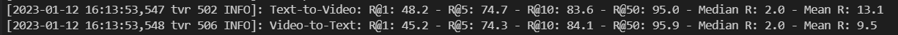

<div align="center">
  
# 【NeurIPS'2022 🔥】Expectation-Maximization Contrastive Learning for Compact Video-and-Language Representations
  
[](https://neurips.cc/Conferences/2022)
[](https://arxiv.org/abs/2211.11427)
</div>

The implementation of NeurIPS 2022 paper [Expectation-Maximization Contrastive Learning for Compact Video-and-Language Representations](https://arxiv.org/pdf/2211.11427.pdf).

### 📣 Updates
* Apr 12 2023: We provide download links for the processed datasets, including MSRVTT, MSVD, ActivityNet Captions, and DiDeMo. (See [EMCL-Net](video_retrieval/EMCL-Net))
* Apr 10 2023: Add MSVD, LSMDC, ActivityNet Captions, and DiDeMo datasets (See [EMCL-Net](video_retrieval/EMCL-Net)).
* Jan 12 2023: Our approach achieves better performance (46.8 -> 48.2 on MSR-VTT dataset) when training with more GPUs (2 -> 8). So we recommend using more GPUs for better performance.


* Dec 14 2022: Add the code of [EMCL-Net](video_retrieval/EMCL-Net).
* Nov 21 2022: Release code for reimplementing the experiments in the paper.

## 🚀 Quick Start
### Datasets
<div align=center>

|Datasets|Google Cloud|Baidu Yun|Peking University Yun|
|:--------:|:--------------:|:-----------:|:-----------:|
| MSR-VTT | [Download](https://drive.google.com/drive/folders/1LYVUCPRxpKMRjCSfB_Gz-ugQa88FqDu_?usp=sharing) | [Download](https://pan.baidu.com/s/1Gdf6ivybZkpua5z1HsCWRA?pwd=enav) | [Download](https://disk.pku.edu.cn:443/link/BE39AF93BE1882FF987BAC900202B266) |
| MSVD | [Download](https://drive.google.com/drive/folders/18EXLWvCCQMRBd7-n6uznBUHdP4uC6Q15?usp=sharing) | [Download](https://pan.baidu.com/s/1hApFdxgV3TV2TCcnM_yBiA?pwd=kbfi) | [Download](https://disk.pku.edu.cn:443/link/CC02BD15907BFFF63E5AAE4BF353A202) |
| ActivityNet | TODO | [Download](https://pan.baidu.com/s/1tI441VGvN3In7pcvss0grg?pwd=2ddy) | [Download](https://disk.pku.edu.cn:443/link/83351ABDAEA4A17A5A139B799BB524AC) |
| DiDeMo | TODO | [Download](https://pan.baidu.com/s/1Tsy9nb1hWzeXaZ4xr7qoTg?pwd=c842) | [Download](https://disk.pku.edu.cn:443/link/BBF9F5990FC4D7FD5EA9777C32901E62) |

</div>

### Model Zoo
<div align=center>

|Checkpoint|Google Cloud|Baidu Yun|Peking University Yun|
|:--------:|:--------------:|:-----------:|:-----------:|
| MSR-VTT | [Download](https://drive.google.com/file/d/1gxTKW5KfXvJK8-3WsOftRtCszMMCssv7/view?usp=sharing) | TODO | [Download](https://disk.pku.edu.cn:443/link/6165FBD0B60C4E1ED83E78ADF9635471) |
| ActivityNet | [Download](https://drive.google.com/file/d/1o4kVq8gHUIxR5wzWNw6NWVX13FGP8W2E/view?usp=drive_link) | [Download](https://pan.baidu.com/s/101iJ4Ml41k3TnWKgbV7sig?pwd=er2w) | [Download](https://disk.pku.edu.cn:443/link/50EBDF3124AD82272F061FE8E7880403) |

</div>

### Text-video Retrieval
* The implementation of EMCL-Net ([video_retrieval/EMCL-Net](https://github.com/jpthu17/EMCL/tree/main/video_retrieval/EMCL-Net)).

* An example of using EMCL as a joint training module ([video_retrieval/as_a_joint_training_module](https://github.com/jpthu17/EMCL/tree/main/video_retrieval/As_a_joint_training_module)).

* An example of using EMCL as an inference module with no extra training ([video_retrieval/as_an_inference_module](https://github.com/jpthu17/EMCL/tree/main/video_retrieval/As_an_inference_module)).

### Video-question Answering
* The implementation of EMCL-QA ([video_question_answering](https://github.com/jpthu17/EMCL/tree/main/video_question_answering)).

## 📕 Overview
Most video-and-language representation learning approaches employ contrastive learning, e.g., CLIP, to project the video and text features into a common latent space according to the semantic similarities of text-video pairs. However, such learned shared latent spaces are not often optimal, and the modality gap between visual and textual representation can not be fully eliminated. In this paper, we propose Expectation-Maximization Contrastive Learning (EMCL) to learn compact video-and-language representations.


## 📚 Method


## 📌 Citation
If you find this paper useful, please consider staring 🌟 this repo and citing 📑 our paper:
```
@inproceedings{
jin2022expectationmaximization,
title={Expectation-Maximization Contrastive Learning for Compact Video-and-Language Representations},
author={Peng Jin and JinFa Huang and Fenglin Liu and Xian Wu and Shen Ge and Guoli Song and David A. Clifton and Jie Chen},
booktitle={Advances in Neural Information Processing Systems},
volume={35},
pages={30291--30306},
editor={Alice H. Oh and Alekh Agarwal and Danielle Belgrave and Kyunghyun Cho},
year={2022}
}
```

## 🎗️ Acknowledgments
Our code is based on [MMT](https://github.com/gabeur/mmt), [CLIP](https://github.com/openai/CLIP), [CLIP4Clip](https://github.com/ArrowLuo/CLIP4Clip/), [DRL](https://github.com/foolwood/DRL) and [CLIP2Video](https://github.com/CryhanFang/CLIP2Video). We sincerely appreciate for their contributions.

[def]: motivation.pdf
